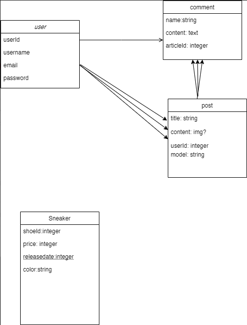
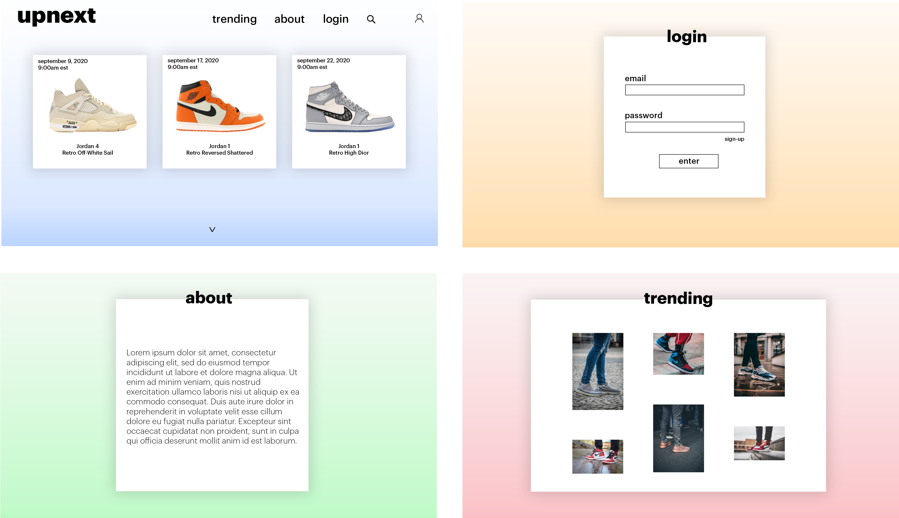

# upnext
upnext is a website where users can find out about upcoming show releases, where to buy them, and how to buy them. upnext users will be able to browse older generations of sneakers and interact with other users through community pages that allow them to post pictures, comment, like, and favorite.

## Setup:
Before I even started coding, there were a few modules and API's that I needed to install. Here is a list of the most utilized ones:
-   sneaks-api
-   sequelize
-   bcrypt
-   cheerio
-   express, ejs, express-ejs-layouts
-   passport
-   pg

## Sneaks-API:
[Sneaks-API](https://github.com/druv5319/Sneaks-API) is a sneaker API created by Dhruv Patel that holds data for all of the sneakers you can think of. Data such as name, price, thumbnail, silhoutte, brand and colorway.

## Sneaker Releases:
In order to track sneaker release dates, I decided to scrape the data from the website, [Sneaker-News](https://sneakernews.com/air-jordan-release-dates/)

## Planning:
I cannot emphasize how important proper planning is when making code.  
One of my favorite verses from the bible says, "Those who sow in tears shall reap with shouts of joy".  
To me this says, if you work/care so much and do things the right way, you will only benefit from that.  
__*No tears were shed during the process of making this app.*__

Here is the ERD that I created that allowed me to visualize the model's that I was creating and their associations to other models.

Here is the wireframe that I created that let me play around with different designs before actually touching any CSS. Although it may not look 100% similar, creating the wireframe beforehand saved me from deciding after the fact and having to go back and forth with CSS. 

 
